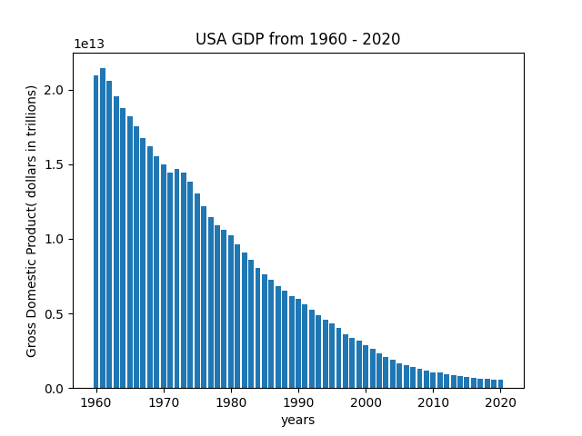
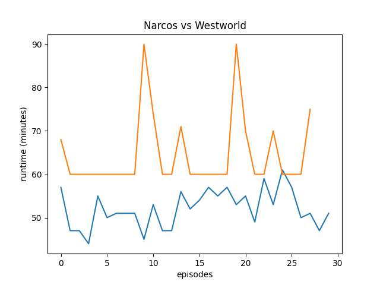

# HW_02

**Here's a small description of my two graphs**

## graph 1: US GDP

This Graph shows how the united states gdp has changed year by year. I used the X axis as the years. The y axis is the GDP of the US in Trillions of dollars.

[My Data Source](http://api.worldbank.org/v2/countries/USA/indicators/NY.GDP.MKTP.CD?per_page=5000&format=json)

## Graph 2: Narcos vs Westworld runtime

This Graph uses a line graph to compare the runtime per episode of Narcos and Westworld. The x axis is a count of the episodes. The Y axis is the runtime in minutes.

**My data sources**

[Narcos](http://api.tvmaze.com/singlesearch/shows?q=narcos&embed=episodes)
 
[Westworld](http://api.tvmaze.com/singlesearch/shows?q=westworld&embed=episodes)

[here's a link to the assignment instructions](https://github.com/mikeizbicki/cmc-csci040)

